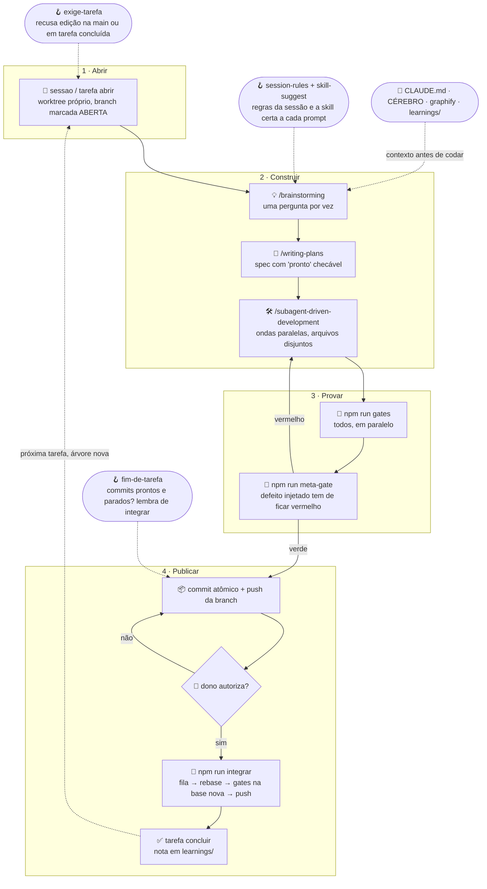

# vibe100coding-kit

**O workflow completo para programar com agentes (Claude Code) sem perder o controle: hooks que impõem o ciclo de tarefa, gates que provam que provam, ondas paralelas de subagentes, integração com rebase antes de validar, e a lei do aprendizado.**

> **EN:** A workflow for coding with agents: 4 Claude Code hooks that enforce a task cycle (no edits on `main`, no stacking on finished tasks, "integrate me" reminders), a parallel gate runner plus a **meta-gate** that injects the real defect to prove every gate turns red, parallel subagent waves with disjoint file sets, rebase-then-validate integration with a per-machine FIFO queue, and templates for `CLAUDE.md`, decisions and learnings. Docs are in Portuguese; the code and hooks are language-agnostic. MIT.

<p align="center">
  <a href="#instalação-passo-a-passo"></a>
  &nbsp;
  <a href="https://github.com/spyko-app/vibe100coding-kit/archive/refs/heads/main.zip"></a>
</p>

## 🗺️ O fluxo completo

Quatro fases num ciclo que se fecha sozinho: **abrir → construir → provar → publicar**, e a próxima tarefa começa de uma árvore atualizada. Os hooks não são etapas: são os trilhos, e recusam o que sai deles (editar na `main`, empilhar tarefa sobre tarefa concluída, esquecer commits sem integrar). Gate vermelho devolve para construir; dono que não autoriza devolve para o commit; nada sobe sem ter sido validado sobre a base em que vai entrar.



Cada etapa existe por causa de um defeito real. A lista, etapa por etapa, está em [`docs/00-fluxo.md`](docs/00-fluxo.md).

## O que vem na caixa

| Peça | Arquivo | O que impõe |
|---|---|---|
| **4 hooks** | `.claude/hooks/*.cjs` | regras da sessão + aviso de árvore velha e de diretório compartilhado · roteamento prompt → skill · **recusa edição na `main`, com HEAD solto, com tarefa concluída ou com mutação de gate em voo** · lembrete de integrar quando há commits parados |
| **Ciclo de tarefa** | `scripts/sessao.mjs`, `tarefa.mjs` | worktree por sessão, marca explícita `aberta / concluida` na branch |
| **Integração** | `scripts/integrar.mjs` | fila FIFO por máquina → fetch → rebase → gates **sobre a base nova** → push; conflito aborta e devolve |
| **Gates** | `scripts/rodar-gates.mjs`, `gates.txt`, `gates/` | todos rodam, em paralelo, acumulando falhas; 3 gates de exemplo (sem comentário no código, sem travessão em texto exibido, lista íntegra) |
| **Meta-gate** | `scripts/meta-gate.mjs`, `mutacoes.mjs` | cobertura por contagem, âncora viva, injeção do defeito real: gate que nunca ficou vermelho não provou nada |
| **Regras** | `.claude/rules/` | roteamento de especialistas (agentes que existem, camada de modelo explícita), ondas paralelas, onda de investigação |
| **Skills** | `.claude/skills/` | `extract-approach` (lei do aprendizado), `sync-main` (publicar com disciplina), `checar-entrega` (régua + segurança antes de entregar); lista das recomendadas na seção Skills |
| **Templates** | `templates/` | `CLAUDE.md` (as quatro leis, erro → regra, régua, escalada), `REGRA.md`, `CEREBRO-AGENTE.md` (como raciocinar), `DECISOES.md`, learning, spec, `kit.json` |
| **Prompts** | `docs/prompts/` | prompt dinâmico (o de todo dia) · brainstorm → spec · onda paralela · varredura de segurança por classe · registrar aprendizado |
| **Instalador** | `bin/vibekit.mjs` | `init` aditivo (nunca sobrescreve o que existe) e `doctor` |

## Instalação (passo a passo)

### Pré-requisitos
- **Node.js 20+** (`node -v`) e **git**.
- **Claude Code** instalado (`claude --version`). Plugins recomendados: `superpowers`, `caveman`, `context7`; opcional `graphify` (`pip install graphifyy`).

### 1. Instale o kit no seu projeto

```bash
cd meu-projeto
npx github:spyko-app/vibe100coding-kit init
```

Ou clonando:

```bash
git clone https://github.com/spyko-app/vibe100coding-kit.git /tmp/vibekit
node /tmp/vibekit/bin/vibekit.mjs init .
```

O `init` copia hooks, regras, skills, scripts e templates **só onde não existe nada** (um `.claude/` afinado por meses fica intacto), mescla os hooks em `.claude/settings.json` e adiciona os scripts `sessao`, `tarefa`, `gates`, `meta-gate`, `integrar` ao `package.json`.

### 2. Descreva o projeto em `kit.json`

```json
{
  "nome": "MeuProjeto",
  "branchPrincipal": "main",
  "pastasLimpas": ["src"],
  "regras": ["O QUE É: descreva o produto em uma frase.", "SEGURANÇA: segredo em env, auth + dono, rate-limit."],
  "skills": [{ "regex": "\\bdeploy\\b", "msg": "Rode os gates antes de publicar." }]
}
```

Tudo é opcional; sem `kit.json` os hooks usam os padrões.

### 3. Preencha `CLAUDE.md` e `docs/REGRA.md`

Os templates vêm com `<marcadores>`. Preencha contexto, comandos e a tabela "erro → regra que previne". O `docs/CEREBRO-AGENTE.md` (como raciocinar) já vem pronto.

### 4. Prove que os gates provam

```bash
npm run meta-gate     # cada gate fica vermelho com o defeito injetado
npm run gates         # todos verdes
npx github:spyko-app/vibe100coding-kit doctor
```

### 5. Commite o kit e abra a primeira tarefa

```bash
git add -A && git commit -m "chore: instala o vibe100coding-kit"
npm run sessao -- feature/primeira-tarefa     # worktree + branch marcada como ABERTA
# ou, sozinho no repo: npm run tarefa -- abrir feature/primeira-tarefa
```

### 6. Abra o Claude Code

Os hooks valem na próxima sessão. Teste: peça para editar um arquivo estando na `main` e veja a recusa com a instrução de abrir tarefa.

### 7. Feche o ciclo

```bash
npm run gates && git add <arquivos> && git commit -m "feat(escopo): o que mudou"
git push -u origin feature/primeira-tarefa
# pergunte ao dono; autorizado:
npm run integrar                 # fila → rebase → gates na base nova → push
npm run tarefa -- concluir
```

### Testar os hooks na mão

```bash
echo '{"prompt":"tem um bug no login"}' | node .claude/hooks/skill-suggest.cjs
echo '{"tool_input":{"file_path":"'$PWD'/src/a.ts"},"cwd":"'$PWD'"}' | node .claude/hooks/exige-tarefa.cjs
```

## Skills

**Vêm no kit** (`.claude/skills/`, instaladas pelo `init`):

| Skill | Quando dispara | O que faz |
|---|---|---|
| `extract-approach` | ao resolver qualquer problema não trivial, "documenta isso", "salva o aprendizado" | escreve a nota em `learnings/` para um modelo mais fraco repetir o caminho (lei do aprendizado) |
| `sync-main` | "sobe pro main", "publica", "integra" | o caminho único para a branch principal: `npm run integrar`, rebase antes, gates na base nova, um push por vez |
| `checar-entrega` | "tá pronto?", "pode publicar?", "entrega isso" | régua do projeto + quatro mínimos de segurança + relatório curto ao dono, antes de qualquer entrega |

**Recomendadas, instale no Claude Code** (o hook `skill-suggest` já as sugere pelo gatilho):

| Skill / plugin | Para quê |
|---|---|
| `superpowers` (`/brainstorming`, `/writing-plans`, `/subagent-driven-development`, `/dispatching-parallel-agents`, `/systematic-debugging`, `/test-driven-development`) | o processo: brainstorm → plano → implementação por subagentes → debug científico → TDD |
| `caveman` | respostas compactas sem perder precisão técnica |
| `context7` | documentação da versão REAL da biblioteca instalada, não a lembrança de treinamento |
| `graphify` | grafo do código; `graphify query` antes de responder sobre arquitetura |
| `humanizer` | texto final para humano sem cara de IA |
| `ui-ux-pro-max` (ou a skill de design da sua stack) | antes de codar interface |
| `last30days` / `deep-research` | pesquisa recente e relatório multi-fonte |

```bash
claude plugin install superpowers caveman context7   # no Claude Code
pip install graphifyy && graphify .                  # opcional, grafo do código
```

## O prompt dinâmico (o de todo dia)

Um prompt só, do brainstorm à entrega testada. Troque apenas o que está entre colchetes.

```
/brainstorming
TROQUE AQUI: [Preciso que você integre com o Resend para verificar o e-mail no cadastro do usuário]

Planeje tudo com /writing-plans e implemente tudo com /subagent-driven-development.
Sempre que der, trabalhe em paralelo com /dispatching-parallel-agents (ondas com arquivos disjuntos).

Depois do brainstorming, tire todas as suas dúvidas de uma vez, aprove o plano
e execute até o fim sem me perguntar mais nada. Me entregue pronto, validado e
testado: gates verdes colados, gate novo com mutação e meta-gate verde.
Para testar o frontend use o agent-browser (Vercel).
```

Variações (bug, só planejar, tarefa mecânica) em [`docs/prompts/00-prompt-dinamico.md`](docs/prompts/00-prompt-dinamico.md).

## Como escrever um gate novo (a lei do gate)

1. `scripts/gates/<nome>.mjs` sai 0 ou 1. Nome diz o que protege.
2. Linha em `scripts/gates.txt` e script `gate:<nome>` no `package.json`.
3. **Mutação** em `scripts/mutacoes.mjs`: o trecho real (`de`) e o defeito (`para`).
4. `npm run meta-gate` verde. Gate sem mutação reprova a cobertura.

Detalhe em [`docs/03-gates-e-meta-gate.md`](docs/03-gates-e-meta-gate.md).

## As quatro leis

1. **Hipótese não é resposta.** Meça, ou diga "não medi; custa X medir".
2. **Se existe uma decisão, use a decisão.** Nunca se escolhe um número.
3. **Nada fica só no chat.** Decisão vai para `docs/` ou `learnings/`.
4. **Gate que não sabe dizer como se prova não protege nada.**

## Documentação

- [`docs/00-fluxo.md`](docs/00-fluxo.md): o fluxo etapa por etapa, com o defeito que originou cada uma
- [`docs/02-hooks.md`](docs/02-hooks.md): os quatro hooks e o `kit.json`
- [`docs/03-gates-e-meta-gate.md`](docs/03-gates-e-meta-gate.md): camadas de gate, onde ancorar, vermelho é dado
- [`docs/04-decisoes-de-desenho.md`](docs/04-decisoes-de-desenho.md): o que foi adotado, o que foi construído e o que ficou de fora, com o motivo
- [`.claude/rules/`](.claude/rules/): roteamento de especialistas · ondas paralelas · onda de investigação
- [`docs/prompts/`](docs/prompts/): prompt dinâmico · brainstorm → spec · onda paralela · varredura de segurança · registrar aprendizado

## Sobre comentários no código

`scripts/` e `.claude/hooks/` são comentados de propósito: cada comentário registra o defeito que originou o mecanismo, e é isso que impede a próxima sessão de "simplificar" o que já falhou. A regra "sem comentário" vale para o código de **produto** (`pastasLimpas`), não para a infraestrutura do fluxo.

## Créditos

[Superpowers](https://github.com/obra/superpowers) · [Caveman](https://github.com/JuliusBrussee/caveman) · [Graphify](https://github.com/safishamsi/graphify) · [Context7](https://context7.com).

## Licença

[MIT](LICENSE)
