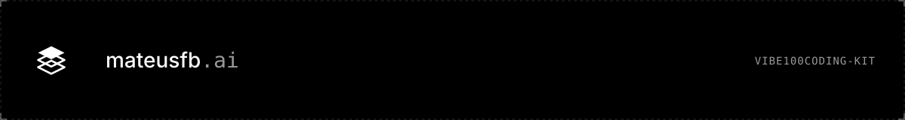
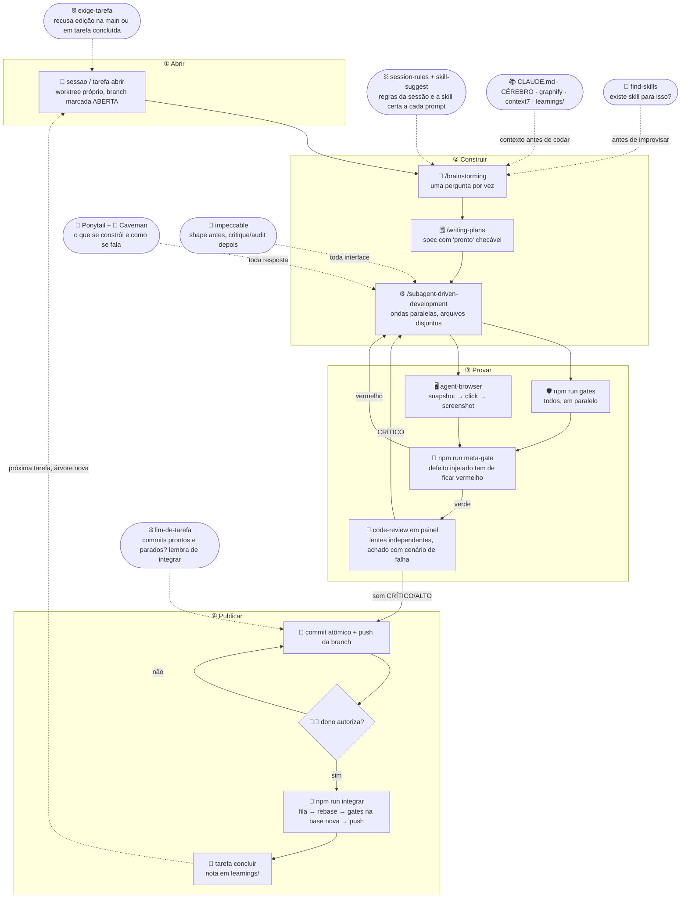

<a href="https://mateusfb-ai.vercel.app"></a>

# vibe100coding-kit

**O workflow completo para programar com agentes (Claude Code) sem perder o controle: hooks que impõem o ciclo de tarefa, gates que provam que provam, ondas paralelas de subagentes, integração com rebase antes de validar, e a lei do aprendizado.**

> **EN:** A workflow for coding with agents: 4 Claude Code hooks that enforce a task cycle (no edits on `main`, no stacking on finished tasks, "integrate me" reminders), a parallel gate runner plus a **meta-gate** that injects the real defect to prove every gate turns red, parallel subagent waves with disjoint file sets, rebase-then-validate integration with a per-machine FIFO queue, and templates for `CLAUDE.md`, decisions and learnings. Docs are in Portuguese; the code and hooks are language-agnostic. MIT.

<p align="center">
  <a href="#instalação-passo-a-passo"></a>
  &nbsp;
  <a href="https://github.com/Mateusfb-ai/vibe100coding-kit/archive/refs/heads/main.zip"></a>
</p>

## 🔁 O ciclo de trabalho

Quatro fases num ciclo que se fecha sozinho: **abrir → construir → provar → publicar**, e a próxima tarefa começa de uma árvore atualizada. Os hooks não são etapas: são os trilhos, e recusam o que sai deles. Gate vermelho devolve para construir; revisão com CRÍTICO devolve para construir; dono que não autoriza devolve para o commit; nada sobe sem ter sido validado sobre a base em que vai entrar.



Cada etapa existe por causa de um defeito real. A lista, etapa por etapa, está em [`docs/00-fluxo.md`](docs/00-fluxo.md); as ferramentas e onde cada uma entra, em [`docs/05-ferramentas.md`](docs/05-ferramentas.md).

## O que vem na caixa

| Peça | Arquivo | O que impõe |
|---|---|---|
| **4 hooks** | `.claude/hooks/*.cjs` | regras da sessão + aviso de árvore velha e de diretório compartilhado · roteamento prompt → skill · **recusa edição na `main`, com HEAD solto, com tarefa concluída ou com mutação de gate em voo** · lembrete de integrar quando há commits parados |
| **Ciclo de tarefa** | `scripts/sessao.mjs`, `tarefa.mjs` | worktree por sessão, marca explícita `aberta / concluida` na branch |
| **Integração** | `scripts/integrar.mjs` | fila FIFO por máquina → fetch → rebase → gates **sobre a base nova** → push; conflito aborta e devolve |
| **Gates** | `scripts/rodar-gates.mjs`, `gates.txt`, `gates/` | todos rodam, em paralelo, acumulando falhas; 3 gates de exemplo (sem comentário no código, sem travessão em texto exibido, lista íntegra) |
| **Meta-gate** | `scripts/meta-gate.mjs`, `mutacoes.mjs` | cobertura por contagem, âncora viva, injeção do defeito real: gate que nunca ficou vermelho não provou nada |
| **Regras** | `.claude/rules/` | roteamento de especialistas (agentes que existem, camada de modelo explícita), ondas paralelas, onda de investigação |
| **Skills** | `.claude/skills/` | `extract-approach` (lei do aprendizado), `sync-main` (publicar com disciplina), `checar-entrega` (régua + segurança antes de entregar); lista das recomendadas na seção Skills |
| **Templates** | `templates/` | `CLAUDE.md` (as quatro leis, erro → regra, régua, escalada), `REGRA.md`, `CEREBRO-AGENTE.md` (como raciocinar), `DECISOES.md`, learning, spec, `kit.json` |
| **Prompts** | `docs/prompts/` | pedido completo (um prompt, do zero ao integrado) · brainstorm → spec · onda paralela · varredura de segurança por classe · code review em painel · registrar aprendizado |
| **Instalador** | `bin/vibekit.mjs` | `init` aditivo (nunca sobrescreve o que existe) e `doctor` |

## Instalação (passo a passo)

### Pré-requisitos
- **Node.js 20+** (`node -v`) e **git**.
- **Claude Code** instalado (`claude --version`). Plugins recomendados: `superpowers`, `caveman`, `context7`; opcional `graphify` (`pip install graphifyy`).

### 1. Instale o kit no seu projeto

```bash
cd meu-projeto
npx github:Mateusfb-ai/vibe100coding-kit init
```

Ou clonando:

```bash
git clone https://github.com/Mateusfb-ai/vibe100coding-kit.git /tmp/vibekit
node /tmp/vibekit/bin/vibekit.mjs init .
```

O `init` copia hooks, regras, skills, scripts e templates **só onde não existe nada** (um `.claude/` afinado por meses fica intacto), mescla os hooks em `.claude/settings.json` e adiciona os scripts `sessao`, `tarefa`, `gates`, `meta-gate`, `integrar` ao `package.json`.

### 2. Descreva o projeto em `kit.json`

```json
{
  "nome": "MeuProjeto",
  "branchPrincipal": "main",
  "pastasLimpas": ["src"],
  "regras": ["O QUE É: descreva o produto em uma frase.", "SEGURANÇA: segredo em env, auth + dono, rate-limit."],
  "skills": [{ "regex": "\\bdeploy\\b", "msg": "Rode os gates antes de publicar." }]
}
```

Tudo é opcional; sem `kit.json` os hooks usam os padrões.

### 3. Preencha `CLAUDE.md` e `docs/REGRA.md`

Os templates vêm com `<marcadores>`. Preencha contexto, comandos e a tabela "erro → regra que previne". O `docs/CEREBRO-AGENTE.md` (como raciocinar) já vem pronto.

### 4. Prove que os gates provam

```bash
npm run meta-gate     # cada gate fica vermelho com o defeito injetado
npm run gates         # todos verdes
npx github:Mateusfb-ai/vibe100coding-kit doctor
```

### 5. Commite o kit e abra a primeira tarefa

```bash
git add -A && git commit -m "chore: instala o vibe100coding-kit"
npm run sessao -- feature/primeira-tarefa     # worktree + branch marcada como ABERTA
# ou, sozinho no repo: npm run tarefa -- abrir feature/primeira-tarefa
```

### 6. Abra o Claude Code

Os hooks valem na próxima sessão. Teste: peça para editar um arquivo estando na `main` e veja a recusa com a instrução de abrir tarefa.

### 7. Feche o ciclo

```bash
npm run gates && git add <arquivos> && git commit -m "feat(escopo): o que mudou"
git push -u origin feature/primeira-tarefa
# pergunte ao dono; autorizado:
npm run integrar                 # fila → rebase → gates na base nova → push
npm run tarefa -- concluir
```

### Testar os hooks na mão

```bash
echo '{"prompt":"tem um bug no login"}' | node .claude/hooks/skill-suggest.cjs
echo '{"tool_input":{"file_path":"'$PWD'/src/a.ts"},"cwd":"'$PWD'"}' | node .claude/hooks/exige-tarefa.cjs
```

## Skills

**Vêm no kit** (`.claude/skills/`, instaladas pelo `init`):

| Skill | Quando dispara | O que faz |
|---|---|---|
| `extract-approach` | ao resolver qualquer problema não trivial, "documenta isso", "salva o aprendizado" | escreve a nota em `learnings/` para um modelo mais fraco repetir o caminho (lei do aprendizado) |
| `sync-main` | "sobe pro main", "publica", "integra" | o caminho único para a branch principal: `npm run integrar`, rebase antes, gates na base nova, um push por vez |
| `checar-entrega` | "tá pronto?", "pode publicar?", "entrega isso" | régua do projeto + quatro mínimos de segurança + relatório curto ao dono, antes de qualquer entrega |

**Recomendadas, instale no Claude Code** (o hook `skill-suggest` já as sugere pelo gatilho):

| Skill / plugin | Para quê |
|---|---|
| `superpowers` (`/brainstorming`, `/writing-plans`, `/subagent-driven-development`, `/dispatching-parallel-agents`, `/systematic-debugging`, `/test-driven-development`) | o processo: brainstorm → plano → implementação por subagentes → debug científico → TDD |
| `ponytail` | a escada da preguiça em todo código: pula → reusa → stdlib → dependência → escreve; causa raiz, não sintoma (`/plugin marketplace add DietrichGebert/ponytail` · `/plugin install ponytail@ponytail`) |
| `caveman` | respostas compactas sem perder precisão técnica |
| `code-review` + `pr-review-toolkit` | revisão antes de integrar: `/code-review` e o painel de revisores independentes (silent-failure-hunter, type-design-analyzer, comment-analyzer) |
| `agent-browser` (Vercel, CLI) | teste de frontend de verdade por árvore de acessibilidade: `open` → `snapshot` → `click/fill @eN` → `screenshot` (`npm i -g agent-browser && agent-browser install`) |
| `find-skills` | "existe skill para X?" busca e instala do ecossistema aberto antes de improvisar (`npx skills add vercel-labs/skills --skill find-skills`) |
| `context7` | documentação da versão REAL da biblioteca instalada, não a lembrança de treinamento |
| `graphify` | grafo do código; `graphify query` antes de responder sobre arquitetura |
| `humanizer` | texto final para humano sem cara de IA |
| `impeccable` | interface com design de verdade: `shape` (planeja UX antes do código), `critique` / `audit` (revisão heurística, a11y, performance, responsivo), `polish` / `harden` / `adapt` (refinar, produção, telas), `clarify` (copy de UI) e `live` (variantes no navegador). Modo por superfície: Persuade, Operate, Read, Experience (`npx skills add pbakaus/impeccable`) |
| `ui-ux-pro-max` (ou a skill de design da sua stack) | paletas, tipografia e padrões de UI antes de codar interface |
| `last30days` / `deep-research` | pesquisa recente e relatório multi-fonte |

```bash
# dentro do Claude Code
/plugin install superpowers@claude-plugins-official
/plugin install caveman@claude-plugins-official
/plugin install code-review@claude-plugins-official
/plugin install pr-review-toolkit@claude-plugins-official
/plugin install context7@context7-marketplace
/plugin marketplace add DietrichGebert/ponytail && /plugin install ponytail@ponytail

# no terminal
npm i -g agent-browser && agent-browser install
npx skills add vercel-labs/skills --skill find-skills
npx skills add pbakaus/impeccable
pip install graphifyy && graphify .          # opcional, grafo do código
```

Tabela completa (o que é, onde entra, custo sempre-ligado) em [`docs/05-ferramentas.md`](docs/05-ferramentas.md).

## O pedido completo (um prompt, do zero ao integrado)

Um prompt só, do brainstorm à entrega testada. O exemplo abaixo é fictício (login com Google); a legenda logo depois diz, frase por frase, o que você troca e o que fica.

```
/brainstorming
Quero adicionar login com Google no app: botão na tela de entrar, callback OAuth,
criação da conta na primeira vez e vínculo com conta já existente pelo e-mail.

Planeje tudo com /writing-plans e implemente tudo com /subagent-driven-development.
Sempre que der, trabalhe em paralelo com /dispatching-parallel-agents (ondas com arquivos disjuntos).

Depois do brainstorming, tire todas as suas dúvidas de uma vez, aprove o plano
e execute até o fim sem me perguntar mais nada. Me entregue pronto, validado e
testado: gates verdes colados, gate novo com mutação e meta-gate verde.
Para testar o frontend use o agent-browser (Vercel). Antes de integrar, rode
o code-review em painel e corrija todo CRÍTICO e ALTO.
```

**Legenda: o que muda e o que fica**

| Trecho | O que é | Muda? |
|---|---|---|
| `/brainstorming` | A skill que abre o ciclo: perguntas antes de código | 🟢 **Fica** (troque por `/systematic-debugging` só se for bug) |
| `Quero adicionar login com Google … pelo e-mail.` | **A sua tarefa**, no lugar do exemplo fictício. Diga o resultado que quer ver, com os limites (o que entra, o que não entra) | 🔴 **Muda sempre**: é a única parte que você escreve |
| `Planeje tudo com /writing-plans e implemente tudo com /subagent-driven-development.` | O caminho plano → execução por subagentes, um passo verificável por vez | 🟢 Fica |
| `Sempre que der, trabalhe em paralelo com /dispatching-parallel-agents (ondas com arquivos disjuntos).` | Autoriza ondas paralelas, com a única condição que as torna seguras | 🟢 Fica (apague se a tarefa é pequena e cabe num agente só) |
| `Depois do brainstorming, tire todas as suas dúvidas de uma vez, aprove o plano e execute até o fim sem me perguntar mais nada.` | Uma rodada de perguntas, depois autonomia. É o "prosseguir é prosseguir" | 🟡 Ajuste: se quiser aprovar o plano você mesmo, troque por "me mostre o plano e espere meu ok" |
| `Me entregue pronto, validado e testado: gates verdes colados, gate novo com mutação e meta-gate verde.` | O critério de pronto do kit: prova colada, não promessa | 🟢 Fica |
| `Para testar o frontend use o agent-browser (Vercel).` | Como provar a tela de verdade | 🟡 Ajuste: apague se não há frontend; troque pela superfície de navegador da sua sessão se preferir |
| `Antes de integrar, rode o code-review em painel e corrija todo CRÍTICO e ALTO.` | A revisão com lentes independentes antes do commit | 🟢 Fica |

Regra prática: **só a segunda linha é sua**. O resto é o fluxo do kit; cada frase existe porque um passo pulado já custou caro.


Variações (bug, só planejar, tarefa mecânica) em [`docs/prompts/00-pedido-completo.md`](docs/prompts/00-pedido-completo.md).

## Como escrever um gate novo (a lei do gate)

1. `scripts/gates/<nome>.mjs` sai 0 ou 1. Nome diz o que protege.
2. Linha em `scripts/gates.txt` e script `gate:<nome>` no `package.json`.
3. **Mutação** em `scripts/mutacoes.mjs`: o trecho real (`de`) e o defeito (`para`).
4. `npm run meta-gate` verde. Gate sem mutação reprova a cobertura.

Detalhe em [`docs/03-gates-e-meta-gate.md`](docs/03-gates-e-meta-gate.md).

## As quatro leis

1. **Hipótese não é resposta.** Meça, ou diga "não medi; custa X medir".
2. **Se existe uma decisão, use a decisão.** Nunca se escolhe um número.
3. **Nada fica só no chat.** Decisão vai para `docs/` ou `learnings/`.
4. **Gate que não sabe dizer como se prova não protege nada.**

## Documentação

- [`docs/00-fluxo.md`](docs/00-fluxo.md): o fluxo etapa por etapa, com o defeito que originou cada uma
- [`docs/02-hooks.md`](docs/02-hooks.md): os quatro hooks e o `kit.json`
- [`docs/03-gates-e-meta-gate.md`](docs/03-gates-e-meta-gate.md): camadas de gate, onde ancorar, vermelho é dado
- [`docs/04-decisoes-de-desenho.md`](docs/04-decisoes-de-desenho.md): o que foi adotado, o que foi construído e o que ficou de fora, com o motivo
- [`.claude/rules/`](.claude/rules/): roteamento de especialistas · ondas paralelas · onda de investigação
- [`docs/05-ferramentas.md`](docs/05-ferramentas.md): Superpowers, Ponytail, Caveman, code-review em painel, agent-browser, find-skills, Graphify, Context7: onde cada uma entra e como instalar
- [`docs/prompts/`](docs/prompts/): pedido completo · brainstorm → spec · onda paralela · varredura de segurança · registrar aprendizado · code review em painel

## Sobre comentários no código

`scripts/` e `.claude/hooks/` são comentados de propósito: cada comentário registra o defeito que originou o mecanismo, e é isso que impede a próxima sessão de "simplificar" o que já falhou. A regra "sem comentário" vale para o código de **produto** (`pastasLimpas`), não para a infraestrutura do fluxo.

## Créditos

[Superpowers](https://github.com/obra/superpowers) · [Caveman](https://github.com/JuliusBrussee/caveman) · [Graphify](https://github.com/safishamsi/graphify) · [Context7](https://context7.com).

## Licença

[MIT](LICENSE)

---

<p align="center"><a href="https://mateusfb-ai.vercel.app"></a><br><sub>Built in public at <a href="https://mateusfb-ai.vercel.app">mateusfb.ai</a></sub></p>
